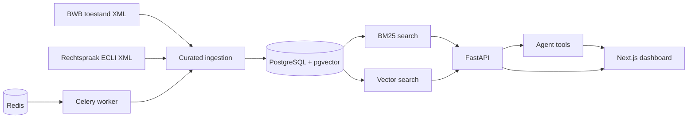

# Veridicta

[](https://github.com/Antho-logan/veridicta/actions/workflows/ci.yml)
[](https://github.com/Antho-logan/veridicta/actions/workflows/eval.yml)
[](#core-commands)

Dutch legal research assistant for source-backed search, ingestion, and agent workflows.

## Quickstart

```bash
cp .env.example .env.local
python3 -m pip install --user -r requirements-backend.txt -r requirements-dev.txt
npm install
brew install pgvector redis
brew services start postgresql@17 || brew services start postgresql
brew services start redis
createdb veridicta_m1 || true
python3 -m alembic upgrade head
npm run gen:api
npm run dev -- -p 3003
python3 -m uvicorn api.main:app --host 127.0.0.1 --port 8000
python3 -m celery -A ingestion.celery_app.celery_app worker --loglevel=INFO
```

`init_db.py` is vestigial and kept only so legacy scripts do not break.

Open `http://localhost:3003/dashboard`.

For a local dashboard preview without email delivery or seeded Auth.js users, keep:

```bash
AUTH_DEV_BYPASS=true
AUTH_SECRET=local-dev-bypass-not-for-production-do-not-reuse
```

Add `OPENAI_API_KEY` to `.env.local` before running embeddings:

```bash
python3 scripts/embedding_coverage_report.py --refresh
python3 create_embeddings.py --mode missing --limit 200 --page-size 100
```

See `docs/embedding_lifecycle_runbook.md` for stale re-embedding, failed retries, and coverage reporting.

## Environment

The backend loads `.env.local` automatically and never requires committing secrets. Use `.env.example` as the template.

Required for local backend:

- `DATABASE_URL=postgresql+psycopg://antho@localhost:5432/veridicta_m1`
- `REDIS_URL=redis://localhost:6379/0`
- `AUTH_SECRET=` long random value shared by NextAuth and FastAPI bearer-JWT validation
- `OPENAI_API_KEY=` only when generating embeddings or LLM answers

## Architecture



## Core Commands

```bash
python3 -m pytest
DATABASE_URL=postgresql+psycopg://antho@localhost:5432/veridicta_m1 python3 smoke_tests/milestone1_smoke_test.py
DATABASE_URL=postgresql+psycopg://antho@localhost:5432/veridicta_m1 python3 evals/run_milestone2_eval.py --limit 10
npm run lint
npm run typecheck
npm test
npm run gen:api
npm run build
pre-commit install
```

## Services

Start API:

```bash
python3 -m uvicorn api.main:app --host 127.0.0.1 --port 8000
```

Start worker:

```bash
python3 -m celery -A ingestion.celery_app.celery_app worker --loglevel=INFO
```

Queue curated ingestion:

```bash
curl -X POST http://127.0.0.1:8000/ingest/laws \
  -H "Authorization: Bearer $VERIDICTA_API_TOKEN" \
  -H 'Content-Type: application/json' \
  -d '{"domain":"employment_law","limit":5}'
curl http://127.0.0.1:8000/ingestion/jobs/1 \
  -H "Authorization: Bearer $VERIDICTA_API_TOKEN"
```

Start web:

```bash
npm run dev -- -p 3003
```

## API Client

The checked-in OpenAPI snapshot lives at `api/openapi.json`. Regenerate the typed client after backend route changes:

```bash
make gen-api
```

Generated types are emitted to `src/lib/api/schema.d.ts`; dashboard pages use the thin wrapper in `src/lib/api/client.ts`.

## Current Known Gaps

- Embeddings require `OPENAI_API_KEY` in `.env.local`.
- Ingestion API triggers return `202 Accepted` and require a running Redis/Celery worker to process jobs.
- Assistant answers are grounded in stored sources; it refuses when the corpus does not support a question.
- Matters and Workflows are limited preview routes in the MVP; they are intentionally not full practice-management surfaces.
- The active corpus focus is employment law, tenancy law, and administrative law.
- Timestamped eval reports are generated under `evals/reports/` and ignored by git.
